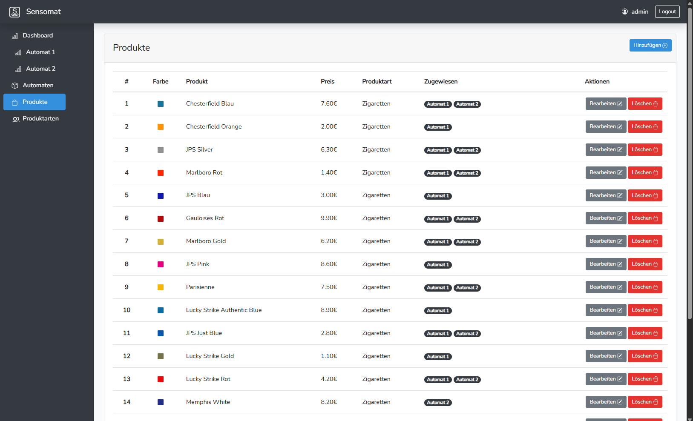
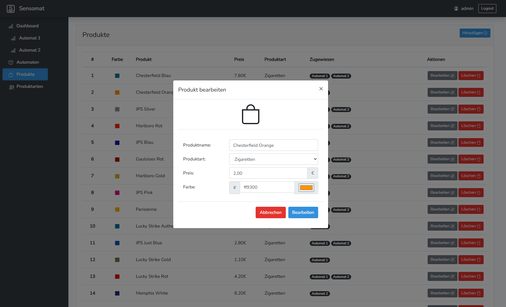

# Sensomat

***Sensomat*** is a full-stack web application consisting of a Vue.js single-page frontend and a Laravel backend with a MySQL database, developed as part of my bachelor’s thesis. The goal of the thesis was to examine how business processes related to the operation and stocking of cigarette vending machines can be optimized through software support. In this context, the application was designed and implemented to provide centralized inventory management and status monitoring. The project also explored which technical and functional requirements such a system must fulfill to support vending machine operators effectively and ensure smooth, transparent supervision of machine performance and stock levels.

## Technologies

**Frontend**: Vue.js (SPA)  

**Backend**: Laravel (PHP Framework)  

**Database**: MySQL  

**Styling**: Bootstrap CSS, jQuery  

**Responsive Design**: Optimized for desktops, tablets, and smartphones  

## Technologies

   
  
  
  
  
  
  

## Architecture

The application follows a classic three-tier architecture consisting of a Vue.js frontend, a Laravel backend, and a MySQL database.

- **Vue.js Client**: The frontend is a single-page application built with Vue.js. It uses Vue Router for client-side routing and Axios for communication with the backend.
- **Laravel Backend**: The backend exposes a RESTful API and follows the MVC pattern to process requests and interact with the database.
- **MySQL Database**: The application stores its data in a relational MySQL database, which is queried and modified by the Laravel backend.

Communication between frontend and backend is handled via HTTP requests and JSON responses. The backend translates these into SQL queries for data persistence and retrieval.

 

 

## API Overview

The backend provides a RESTful API built with Laravel. It exposes multiple endpoints to manage products, vending machines, product types, and authentication. The API follows common REST conventions using `apiResource` routes where applicable, and is designed for structured, programmatic access.

---

### 📦 Product API (`ProductController`)

| Method | Path                   | Action  | Description                              |
|--------|------------------------|---------|------------------------------------------|
| GET    | /api/product           | index   | Returns a list of all products           |
| POST   | /api/product           | store   | Stores a new product                     |
| GET    | /api/product/{product} | show    | Returns a specific product               |
| PUT    | /api/product/{product} | update  | Updates a specific product               |
| DELETE | /api/product/{product} | destroy | Deletes a specific product               |

---

### 🔐 Authentication & Login

| Method | Path                   | Controller           | Description                                 |
|--------|------------------------|----------------------|---------------------------------------------|
| POST   | /api/login             | LoginController      | Logs in a user                              |
| POST   | /api/logout            | LoginController      | Logs out a user                             |
| GET    | /api/authenticated     | –                    | Checks whether a user is currently logged in|
| GET    | /sanctum/csrf-cookie   | CsrfCookieController | Returns a CSRF cookie                       |

---

### 🏪 Vending Machine API (`AutomatController`)

| Method | Path                                | Description                                                           |
|--------|-------------------------------------|-----------------------------------------------------------------------|
| GET    | /api/automat                        | Returns a detailed list of all vending machines                       |
| POST   | /api/automat                        | Stores a new vending machine                                          |
| GET    | /api/automat/{automat}             | Returns a specific vending machine                                    |
| PUT    | /api/automat/{automat}             | Updates a specific vending machine                                    |
| DELETE | /api/automat/{automat}             | Deletes a specific vending machine                                    |
| GET    | /api/automat/basic/{id}            | Returns a basic view of a specific vending machine                    |
| GET    | /api/automat/shafts/{id}           | Returns all product slots of a specific vending machine               |
| GET    | /api/automat/{id}                  | Returns the current status of a specific vending machine              |
| GET    | /api/automats/basic                | Returns a simplified list of all vending machines                     |
| GET    | /api/automats/names                | Returns a list of all vending machine names                           |
| GET    | /api/automats/status               | Returns the fill level status of all vending machines                 |
| POST   | /api/automat/shafts                | Stores product-slot assignments                                       |
| POST   | /api/automat/shafts/config         | Stores slot configuration                                             |

---

### 🗂️ Product Type API (`ProductTypeController`)

| Method | Path                                 | Description                                         |
|--------|--------------------------------------|-----------------------------------------------------|
| GET    | /api/productType                     | Returns a detailed list of all product types        |
| POST   | /api/productType                     | Stores a new product type                           |
| GET    | /api/productType/{productType}       | Returns a specific product type                     |
| PUT    | /api/productType/{productType}       | Updates a specific product type                     |
| DELETE | /api/productType/{productType}       | Deletes a specific product type                     |
| GET    | /api/productTypes/basic              | Returns a simplified list of all product types      |

## ✨ Features

### 🔑 Login

Users authenticate via a login form before accessing the system.

### 📊 Dashboard

The dashboard provides a quick overview of all vending machines. Machines are displayed with fill level indicators, and users can navigate to a detailed view.

### 🖨️ Detailed Machine View

Each vending machine shows:

- Temperature and humidity readings
- Current fill level
- WiFi status with IP address and last connection
- Door status and last opening time
- Inventory overview with capacity and current stock per product

### ⚙️ Vending Machine Management

Machines can be added and managed, including location data like:

- Street
- City
- Region
- Country

### 🔽 Slot Configuration

Slot data can be configured per machine. Each slot has:

- Physical length in millimeters
- Maximum product capacity in packages

Users can assign products to specific slots.

### 🍌 Product Management

A dedicated section allows for managing the product catalog:

- Add, edit or delete products
- Set product attributes such as name, price, color, and category
- Assign products to vending machines

Product editing is done through a modal dialog.

### 🌈 Product Categories

Users can manage product categories (e.g. cigarettes, cigars) and set category-specific parameters like product depth.

## 📱 Responsive Web Design

The interface adapts seamlessly to different screen sizes. On smaller devices, a mobile menu replaces the sidebar and content is reorganized for optimal usability.

The following examples show the interface on mobile devices:

- **Mobile Menu View**  
  A compact menu replaces the full sidebar.

  

- **Mobile Product View**  
  Products are displayed in a stacked layout, preserving full functionality.

  

- **Mobile Toast Notification**  
  Confirmation messages such as successful product addition are shown via toast alerts.

  

## License

This project was developed for academic purposes as part of a bachelor's thesis. It is provided without warranty.
